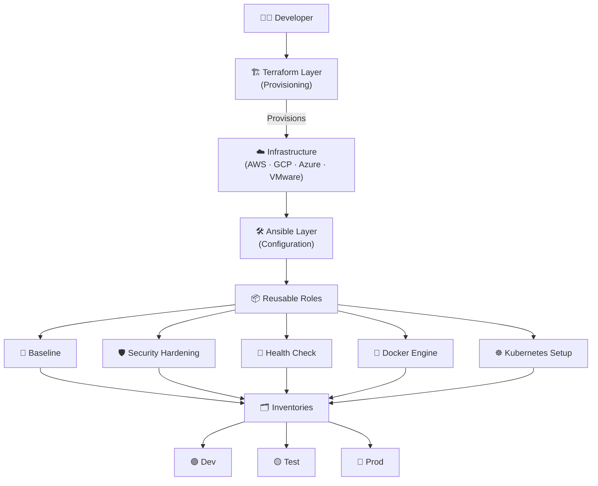

<div align="center">

# 🚀 Automation Infrastructure Configuration
### — *Ready-to-Go Framework* —

**Developed by [Danilo Cerdas S.](https://github.com/Alephdjcs)**

  
  
  
  
  
</p>
</div>

> **A structured Infrastructure as Code (IaC) framework.** > This project leverages **Terraform** for the provisioning layer and **Ansible** for the configuration management layer, ensuring a clean, modular, and production-ready foundation.
---
## 📖 Table of Contents
* [Architecture Overview](#-architecture-overview)
* [Configuration Layer](#-configuration-layer-ansible)
* [Getting Started](#-getting-started)
* [Core Roles](#-core-roles-detail)

---
🏗 Architecture Overview

The project follows a logical top-down flow from initial code development to environment-specific deployment:
Code snippet

---




## 🏗️ Infrastructure Layer (Terraform)

The infrastructure is managed using a modular approach in AWS, ensuring scalability and separation of concerns.

### 📂 Directory Structure
```text
infrastructure/
├── main.tf                    # Main entry point (calls modules)
├── providers.tf               # AWS Provider configuration
├── variables.tf               # Global variables (Region, Project Name)
├── outputs.tf                 # Public IP and resource outputs
├── templates/                 # Templates for dynamic files
│   └── ansible_inventory.tftpl # Auto-generates Ansible hosts.ini
└── modules/                   # Isolated infrastructure components
    ├── networking/            # VPC, Subnets, IGW, Route Tables
    ├── security/              # Security Groups (Firewalls)
    └── compute/               # EC2 Instances (Ubuntu)
```


## 🛠️ Configuration Layer (Ansible)

The Ansible layer is designed to be OS-agnostic and environment-aware.

### 📂 Directory Structure
```text
configuration/
├── ansible.cfg                # Global Ansible settings
├── inventories/               # Environment-specific host management
│   ├── dev | test | prod      # Host files and group variables
├── playbooks/                 # Orchestration of execution flows
│   ├── baseline.yml           # Initial OS setup
│   ├── docker.yml             # Docker Engine deployment
│   ├── k8s_setup.yml          # Kubernetes node installation
│   └── healthcheck.yml        # System status verification
└── roles/                     # Modular, reusable logic
    ├── os_baseline/           # Multi-OS setup (Debian/RedHat)
    ├── docker/                # Docker installation & services
    ├── kubernetes/            # K8s binaries & networking
    └── security_hardening/    # Security policies & SSH hardening
```

---

## Getting Started

### 1️ Prerequisites
Install Ansible on your control node:
```bash
sudo apt update && sudo apt install ansible -y
```

### 2️Inventory Configuration
Define your target hosts in `inventories/dev/hosts.ini`:
```ini
[all]
192.168.1.50 ansible_user=adminops
```

### 3️Running Playbooks
```bash
cd configuration
ansible-playbook playbooks/baseline.yml -i inventories/dev/hosts.ini -K
```

---

## Core Roles Detail
### 🔹 terraform_install
* Prepares the Control Node by adding the official HashiCorp repository and installing the Terraform CLI.

### 🔹 os_baseline
* Prepares the operating system. Automatically detects `Debian` or `RedHat`.
* **Actions:** Updates cache, installs tools (`git`, `vim`, `curl`), and optimizes **swappiness**.

### 🔹 security_hardening
* Disables `root` login via SSH.
* Limits authentication attempts.
* Configures SSH Grace Time.

### 🔹 kubernetes & docker
* **Docker:** Installs engine and manages user groups.
* **K8s:** Installs `kubeadm`, `kubectl`, and `kubelet`.

---

## 🏥 Health Check
To verify system health:
```bash
ansible-playbook playbooks/healthcheck.yml -i inventories/dev/hosts.ini
```

**Maintainer:** [@Alephdjcs](https://github.com/Alephdjcs)
