<div align="center">

# 🚀 Automation Infrastructure Configuration
### — *Ready-to-Go Framework* —

**Developed by [Danilo Cerdas S.](https://github.com/Alephdjcs)**

  
  
  
  
  
</p>
</div>

> **A structured Infrastructure as Code (IaC) framework.** > This project leverages **Terraform** for the provisioning layer and **Ansible** for the configuration management layer, ensuring a clean, modular, and production-ready foundation.
---
## 📖 Table of Contents
* [Architecture Overview](#-architecture-overview)
* [Configuration Layer](#-configuration-layer-ansible)
* [Getting Started](#-getting-started)
* [Core Roles](#-core-roles-detail)

---
## 🏗️ Architecture Overview

The workflow follows a top-down approach: Terraform builds the "house" (VPC, Security, VM), and Ansible "furnishes" it (OS Setup, Docker, Kubernetes).

---



```mermaid
graph TD
    %% Entry Point
    DevOps["👨‍💻 DevOps Engineer"] --> Scripts["🚀 Automation Layer<br/>(deploy.sh / destroy.sh)"]

    %% Infrastructure Phase
    Scripts --> TF["🏗️ Terraform Layer<br/>(Provisioning)"]
    TF --> Modules["📦 Terraform Modules<br/>(Networking · Security · Compute)"]
    Modules --> AWS["☁️ AWS Infrastructure"]

    %% The Bridge
    TF -->|Auto-generates| Inventory["🗂️ Dynamic Inventory<br/>(hosts.ini)"]

    %% Configuration Phase
    Scripts --> Ansible["🛠️ Ansible Layer<br/>(Configuration)"]
    Inventory --> Ansible
    
    Ansible --> Roles["📦 Reusable Roles"]
    
    %% Specific Roles
    Roles --> TF_Inst["🔹 Terraform Install"]
    Roles --> Base["🔹 OS Baseline"]
    Roles --> Hard["🛡️ Security Hardening"]
    Roles --> Dock["🐳 Docker Engine"]
    Roles --> K8s["☸️ Kubernetes Setup"]
    
    %% Environment Delivery
    Base & Hard & Dock & K8s --> Env["🚀 Target Environments"]
    Env --> D["🟢 Dev"]
    Env --> T["🟡 Test"]
    Env --> P["🔴 Prod"]
```

## 🚀 Automation Suite

I have simplified the deployment lifecycle into two master scripts:

To deploy to DEV (default/local):
./deploy.sh

To deploy to TEST:
./deploy.sh test

To deploy to PROD:
./deploy.sh prod

* **`./destroy.sh`**: 
    1. Runs `terraform destroy`.
    2. Cleans up local inventory files to prevent IP conflicts.
       
    
## 📂 Project Structure

### 🏗️ Infrastructure Layer (Terraform)
Located in `/infrastructure`, organized by isolated modules:
* **Networking**: Manages VPC, Public Subnets, Internet Gateway, and Route Tables.
* **Security**: Defines Security Groups (Stateful Firewalls) for SSH (22) and HTTP (80).
* **Compute**: Handles EC2 Instance provisioning (Ubuntu 22.04 LTS) and SSH Key associations.
* **Templates**: Uses `.tftpl` to auto-generate Ansible-ready inventory files.

### ⚙️ Configuration Layer (Ansible)
Located in `/configuration`, featuring reusable roles:
* **`terraform_install`**: Prepares the Control Node with HashiCorp tools.
* **`os_baseline`**: Multi-OS support (Debian/RedHat) for updates and essential tools (Git, Vim, Curl).
* **`security_hardening`**: Hardens SSH access and disables insecure root logins.
* **`docker`**: Automated installation of Docker Engine and Compose.
* **`kubernetes`**: Pre-configures nodes with Kubeadm, Kubectl, and Kubelet.
  

---

## Getting Started

### 1️ Prerequisites
* AWS account with a Key Pair named `my-aws-key`.
* Local AWS credentials configured (`aws configure`).
* Private key permissions: `chmod 400 ~/.ssh/my-aws-key.pem`, the .pem file must be at ~/.ssh/my-aws-key.pem for the Ansible inventory template to work.
* infrastructure/terraform.tfvars: To change the aws_region or project_name
* Currently using t2.micro. If you need more power for Kubernetes, you might want to change it to t3.medium.
* disable_password_auth: false : This is the safest way to start. If you change this to true before confirming their SSH Key works, you could lock yourself out forever.
* Install Ansible on your control node:
```bash
sudo apt update && sudo apt install ansible -y
```

### 2️Inventory Configuration
```bash
# Clone the repository
git clone [https://github.com/Alephdjcs/automation-infrastructureconfiguration-readytogo.git](https://github.com/Alephdjcs/automation-infrastructureconfiguration-readytogo.git)
cd automation-infrastructureconfiguration-readytogo

# Launch the entire stack
./deploy.sh

```
The user does not need to:

    Install Terraform (Ansible installs it on the first step).
    Create the VPC or Subnets (Terraform does it).
    Manually copy IP addresses (The local_file bridge handles the inventory).
    Install Docker or K8s (Ansible roles handle it).
    
---

## Core Roles Detail
### 🔹 terraform_install
* Prepares the Control Node by adding the official HashiCorp repository and installing the Terraform CLI.

### 🔹 os_baseline
* Prepares the operating system. Automatically detects `Debian` or `RedHat`.
* **Actions:** Updates cache, installs tools (`git`, `vim`, `curl`), and optimizes **swappiness**.

### 🔹 security_hardening
* Disables `root` login via SSH.
* Limits authentication attempts.
* Configures SSH Grace Time.

### 🔹 kubernetes & docker
* **Docker:** Installs engine and manages user groups.
* **K8s:** Installs `kubeadm`, `kubectl`, and `kubelet`.

---

## 🏥 Health Check
To verify system health:
```bash
ansible-playbook playbooks/healthcheck.yml -i inventories/dev/hosts.ini
```

**Maintainer:** [@Alephdjcs](https://github.com/Alephdjcs)
